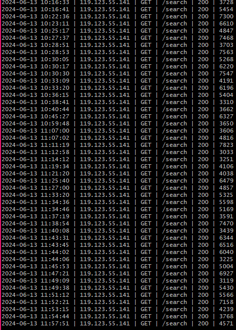
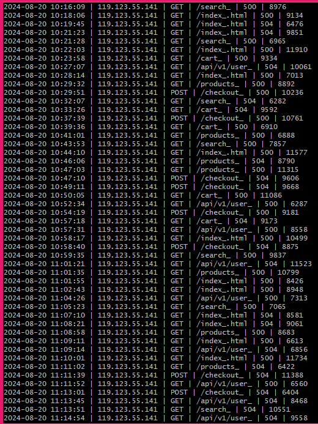

Hackathon 1 

--------------------------------------------------------------------

# หา ip address ที่มีการใช้งานซ้ำๆ เยอะๆแบบแค่ ip address เพียวๆเพื่อนำไปใช้งานต่อ

โดยใช้คำสั่งของ linux โดยเราจะใช้ git bash ซึ่งรองรับคำสั่งเหมือน linux เลย

grep -E '\| (C|500|504) \|' cart_web.log | awk -F'|' '{print $2}' | sed 's/ //g' | sort | uniq -c | sort -rn | awk '{print $2}' > ip_list.txt

grep : ค้นหา -E เป็นการค้นหาขั้นสูงเพื่อให้ระบบเข้าใจสัญลักษณ์ (500|504) คือหาคีย์เวิร์ดคำว่า 500 และ 504 และตำแหน่ง file ที่จะค้นหา cart_web.log 
awk : ระบุชุดข้อมูล -F : แบ่งคอลัมน์โดยใช้ '|' เป็นตัวกำหนดในการแบ่ง '{print $2}' แสดงคอลัมน์ 2 ในที่นี้คือ ip address 

| ทำให้สามารถใช้คำสั่งอื่นต่อได้เลย
sed : ใช้ ค้นหา แทนที่ หรือลบได้ s/ //g หมายถึง ให้หาช่องว่างแล้วลบทิ้งให้หมด g คือทำทั้งบรรทัด เหตุผลเพื่อจะได้ ip address เพียงอย่างเดียว
sort : เรียงลำดับ
uniq -c : *ต้อง sort ก่อนเพราะว่า คำสั่งนี้จะยุบบรรทัดซ้ำที่ติดกันและนับ
sort -rn : เรียงตัวเลขจากมากไปน้อย
awk '{print $2}' > ip_list.txt เนื่องจากในตอนนี้จะขึ้น [จำนวนที่ซ้ำ] [IP] คำสั่งนี้ '{print $2}' คือเอาแค่ ip address ไปสร้างใหม่ใน file : ip_list.txt

เมื่อรันเสร็จจะได้ file ip address เพียวๆ เพื่อนำไปดึงข้อมูลต่อ

# จากนั้นเราจะเอา ip address ไปดึงข้อมูลแบบเอามาทั้งแถวเพื่อดูพฤติกรรมของแฮกเกอร์

grep -Ff ip_list.txt cart_web.log | sort -t'|' -k2,2

grep : ค้นหา -F คำตรงตัวทำให้ . ใน IP ไม่ต้องมองเป็น Regex ดิจิทัล f เป็นการบอกว่าคีย์เวิร์ดที่จะใช้ค้นหาอยู่ใน file ที่เรากำหนดก็คือ ip_list.txt คือ ip address ที่เราเก็บมา

cart_web.log คือไฟล์ที่ต้องการค้นหาข้อมูล  

| ทำให้สามารถใช้คำสั่งอื่นต่อได้เลย 
sort เรียงลำดับ -t เป็นการตั้งค่า ตัวคั่นช่อง '|' ระบุว่า ใน Log ของเรา ให้ใช้เครื่องหมาย pipe คั่น -k คือคอลัมน์หลักที่เราจะใช้ค่ำสั่ง 2,2 คือให้ดูคอลัมน์ 2 ไปจนถึงคอลัมน์ 2 คววมหมายของโค้ดชุดนี้คือ เรียงลำดับที่ตำแหน่ง ip address 

** cart_web.log เป็นไฟล์ขนาดใหญ่มากจะทำให้ช้ามากในการรันคำสั่งแต่สามารถเก็บ error แยกเพื่อให้ไฟล์เล็กลงและค่อยน้ำมาใช้ได้ตัวอย่างไฟล์ที่มีให้
504.txt คือไฟล์ที่เอาทั้งแถวของข้อมูลที่เกิด error 504.txt มาเก็บไว้เราสามารถใช้ grep -Ff ip_list.txt 504.txt | sort -t'|' -k2,2 
แทนเพื่อหาเพื่อหาช่วงที่เซิร์ฟมี error จาก ip addrass ที่ดูแปลกๆได้เพื่อลดภาระของการค้นหาได้ แต่ไม่ใช่ว่าสถานะปกติจะไม่มีปัญหา

# การวิเคราะห์ข้อมูล

<table >
  <tr>
    <td width="55%" valign="top">
      
    </td>
    <td width="45%" style="margin-top: 25px;">
      <h2> ผลการวิเคราะห์ข้อมูล</h2>
      
จาก Log ด้านซ้าย เป็นพฤติกรรมของ IP 119.123.55.141:

      <ul>
        <li style="margin-bottom: 15px;"><strong>พฤติกรรม:</strong> เน้นยิงไปที่ Endpoint <code>/search</code> อย่างต่อเนื่อง</li>
        <li style="margin-bottom: 15px;"><strong>สถานะระบบ:</strong> ได้รับ HTTP Status 200 (ปกติ) ทั้งหมด</li>
        <li><strong>ความเร็วการตอบสนอง:</strong> อยู่ในเกณฑ์ 3,000 - 7,500 ms ซึ่งระบบเริ่มประมวลผลช้าลงชัดเจน</li>
      </ul>
    </td>
  </tr>
</table>

<table>
  <tr>
    <td width="55%" valign="top">
      
    </td>
    <td width="45%" style="margin-top: 42px; ">
      <h2> ผลการวิเคราะห์ข้อมูล</h2>
      
จาก Log ด้านซ้าย เป็นพฤติกรรมของ IP 119.123.55.141:

        <ul>
        <li style="margin-bottom: 15px;"><strong >1. พฤติกรรมการโจมตี (Attacker Behavior):</strong> 
            ยังคงเป็นบอตอัตโนมัติแต่รอบนี้ยิงยาวต่อเนื่องร่วม 1 ชั่วโมงเต็ม โดยพยายามเจาะระบบและเดาสุ่ม Endpoint ไปที่หน้าหลัก 
            <code>/index_.html</code>, หน้าค้นหา <code>/search_</code>, และพยายามยิงหน้าระบบจ่ายเงิน <code>/checkout_</code> แบบถถี่ๆ ซ้ำๆ
        </li>
        <li style="margin-bottom: 15px;"><strong>2. สถานะเซิร์ฟเวอร์ล่ม 100% (Complete Downtime):</strong> 
            รอบนี้ระบบแย่กว่าเดิมมาก เพราะคอลัมน์ Status Code ไม่มีเลข 200 หลุดมาเลยแม้แต่บรรทัดเดียวข้อมูลฟ้องว่าระบบเจอ 
            <strong>HTTP 500 (Server Error)</strong> สลับกับ <strong>HTTP 504 (Gateway Timeout)</strong> ตลอดทั้งชั่วโมง แปลว่าเว็บแอปพลิเคชันหลังบ้านพังน็อกไปเรียบร้อย
        </li>
        <li><strong>3. อาการหน่วงจัด (High Latency):</strong> 
            เมื่อดูที่คอลัมน์สุดท้ายที่ความเร็วการตอบสนอง จะพบว่าค่าเกือบทั้งหมดทะลุ <strong>8,000 ms ไปจนถึง 11,000+ ms (8-11 วินาที)
            </strong> นี่คือสัญญาณชัดเจนว่าทรัพยากรบนเครื่อง เช่น CPU, RAM หรือ Connection Pool ของ Database 
            ถูกบอตตัวนี้จองและดึงไปใช้จนเต็มพิกัด ทำให้เครื่องไม่ตอบสนองต่อผู้ใช้งานปกติเลย
        </li>
        </ul>
    </td>
  </tr>
</table>
